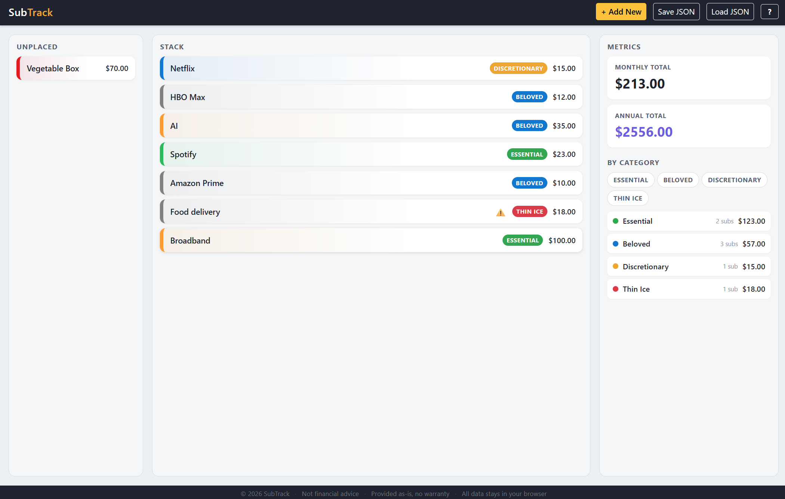

# SubTrack

> A drag-and-drop subscription cost tracker. One HTML file. No install. No server. No account.
>
> Check out the subscription tracker here: [[Subscription Tracker](https://stevebowden.github.io/subscription-tracker/)](https://stevebowden.github.io/subscription-tracker/)


[](LICENSE)
[](#)
[](#)

<!-- TODO: Replace screenshot.png with a real screenshot before publishing -->


SubTrack helps you visualise the true cost of your recurring subscriptions. Drag each one into a stack, colour-code them, assign a category (Essential, Beloved, Discretionary, Thin Ice ⚠️), and watch the monthly and annual totals update live.

---

## Features

- 🧱 **Drag-and-drop stack** — drag subscriptions in, out, and reorder them
- 🎨 **Colour coding** — 12 preset swatches plus full custom hex picker
- 🏷️ **Four categories** — Essential, Beloved, Discretionary, Thin Ice (with ⚠️ warning)
- 📊 **Live metrics** — monthly + annual totals and per-category breakdown
- 🔍 **Highlight filters** — click a category pill to spotlight matching cards
- 💾 **Save / Load JSON** — back up your stack as a plain JSON file

## Usage

1. **Download** [`index.html`](index.html) (or clone this repository).
2. **Open** the file in any modern browser — no server, no install, no build step required.
3. **Click `+ Add New`** in the top bar to create your first subscription, then drag it into the stack.

That's it. Use `Save JSON` to back up, `Load JSON` to restore. Click `?` in the top bar for in-app help at any time.

## Tech Stack

- **HTML5** + **CSS** + **vanilla JavaScript** (no frameworks, no build tools)
- **[Bootstrap 5](https://getbootstrap.com/)** — CSS only, served via CDN
- **HTML5 Drag and Drop API** — native browser drag interactions
- **File API** (`FileReader` + `Blob`) — local save and load
- **`crypto.randomUUID()`** with a fallback for `file://` contexts

## Data Format

Saved files are plain, human-readable JSON:

```json
{
  "version": "1.0",
  "savedAt": "2026-05-28T12:34:56.789Z",
  "subscriptions": [
    {
      "id": "uuid-here",
      "name": "Netflix",
      "color": "#e50914",
      "monthlyCost": 22.99,
      "category": "beloved",
      "placed": true,
      "stackOrder": 0
    }
  ]
}
```

You can edit them by hand if you like.

## Browser Support

Any modern desktop browser (Chrome, Edge, Firefox, Safari) released in the last few years. Touch devices are not officially supported — HTML5 drag-and-drop does not work on touchscreens out of the box.

## Disclaimer

SubTrack is provided **"as is"**, without warranty of any kind, express or implied. It is a personal productivity tool for visualising subscription costs only.

Nothing in this application constitutes **financial advice**. The authors and contributors accept no liability for any decisions made based on the information it displays.

All data is stored **locally in your browser**. Nothing is transmitted, uploaded, or shared with any third party. Closing the tab without saving will discard your data.

## License

[MIT](LICENSE) &copy; 2026 SubTrack Contributors
